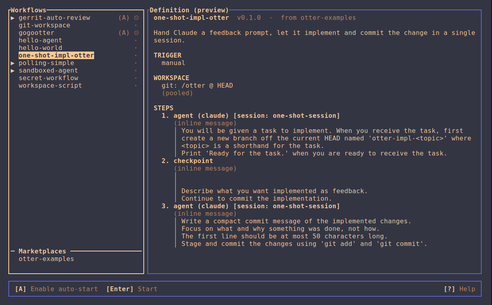

# otter

Allows you to define workflows that will automatically be executed in the background on your machine.

It is designed to be easily extensible and workflows can be built to respond to events such as being tagged as a reviewer, assigned to tickets or react to whatever API you have access to.

- **Workflows** are TOML-defined series of steps
- **Steps** can drive bash scripts, Claude, Copilot or any AI CLI
- **Checkpoints** pause for human review and feedback
- **Workspaces** isolate workflows per-run

All driven by an intuitive **TUI dashboard**.



## Prerequisites

- For agent steps: Any of Claude Code, Copilot CLI, other AI CLI tools
- For sandbox: [Podman](https://podman.io)

## Quick Start

```bash
# Install workflow
otter workflow install examples/hello-world

# Start background service
otter service start

# Open the TUI
otter
# or start workflow via CLI:
otter start hello-world

# Stop background service
otter service stop
```

## Common Commands

| Command              |                                               |
| -------------------- | --------------------------------------------- |
| `otter`              | open the TUI dashboard                        |
| `otter help`         | show all commands                             |
| `otter status`       | list service, workflow, and marketplace state |
| `otter update`       | install a newer otter release                 |
| `otter start <name>` | start or resume a workflow                    |
| `otter stop <name>`  | stop a running workflow                       |

### Managing the otter service

| Command                 |                      |
| ----------------------- | -------------------- |
| `otter service start`   | bring the service up |
| `otter service stop`    | take it down         |
| `otter service enable`  | enable auto-boot     |
| `otter service disable` | disable auto-boot    |

`otter service enable` is the only path that writes outside otter's own directories (it installs a systemd user unit), `disable` removes it.

## Example Workflows

Can be found in the [examples/](examples/) directory.

### Marketplaces

Install workflows by name from any git repo that publishes them. This
repository doubles as one:

```bash
otter marketplace add "$(pwd)"
otter workflow install todo-impl@otter
```

## Build

```bash
cargo build --release
# Binary is at: target/release/otter
```

## User Data

| Purpose                        | Linux                   | Windows            |
| ------------------------------ | ----------------------- | ------------------ |
| Configuration & workflows      | `~/.config/otter/`      | `%APPDATA%\otter\` |
| State, logs & run scratch dirs | `~/.local/share/otter/` | `%APPDATA%\otter\` |

## Configuration Reference

A reference for all possible configurations (step types, triggers and
workspace configuration) can be found in the [usage guide](USAGE.md).
